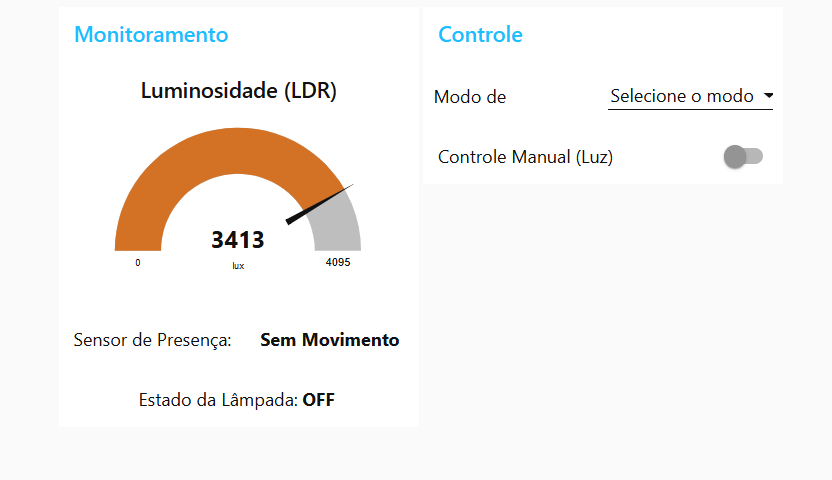
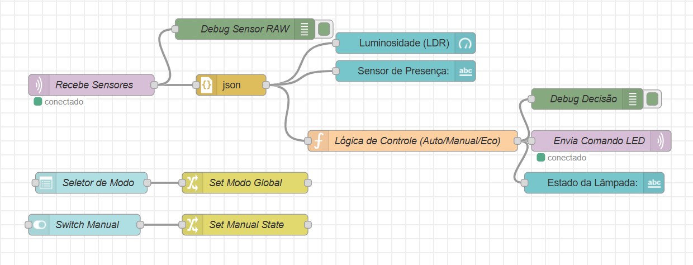

# 🌐 Smart IoT Lighting System - ESP32 & Node-RED

This repository contains the complete firmware and architectural design for an **IoT Edge Node** developed in **C++**. The system monitors environmental conditions (motion and light) using an **ESP32** and provides a real-time control interface via **Node-RED** and the **MQTT** protocol.

## 📋 Project Overview

The system is designed to simulate a smart residential lighting solution. It collects telemetry data from a **PIR** sensor (motion) and an **LDR** (luminosity), publishing this information as **JSON** payloads. A remote dashboard built in **Node-RED** processes this data and sends command signals back to the device.

## 📸 System Demonstration

### 1. Hardware Architecture & States
The project was simulated using **Wokwi**. Below is a comparison between the initial state and the active state receiving MQTT commands.

| Initial State (Idle) | Active State (LED ON + Logs) |
| :---: | :---: |
|  |  |
| *Standard wiring setup (LED OFF).* | *System receiving "ON" command via MQTT (Log visible).* |

### 2. Real-Time Monitoring Dashboard
The Node-RED dashboard provides a clean UI to track sensor values and toggle between manual and automatic control modes.

| High Ambient Light Scenario | Low Ambient Light Scenario |
| :---: | :---: |
|  |  |
| *System at 516 lux (Low Light Mode).* | *System at 3413 lux (Daylight Mode).* |

---

## 🛠️ Tech Stack

* **Language:** C++ (Arduino Framework)
* **Microcontroller:** ESP32
* **Communication Protocol:** MQTT (Broker: `broker.hivemq.com`)
* **Backend & Dashboard:** Node-RED
* **Data Format:** JSON
* **Simulation Environment:** Wokwi

---

## 🔗 Backend Logic (Node-RED)

The logic layer manages the data flow, applying conditional rules (Auto/Manual/Eco modes) before sending commands back to the ESP32.

  

---

## 🚀 Getting Started

1.  **Hardware:** Open the `main.cpp` file and upload it to your ESP32 or use the Wokwi simulator.
2.  **MQTT Config:** * **Telemetry Topic:** `nelson_iot/sensores`
    * **Command Topic:** `nelson_iot/led_cmd`
3.  **Dependencies:** Ensure the `PubSubClient` and `WiFi` libraries are installed in your environment.
4.  **Dashboard:** Import your Node-RED flow and connect it to the same MQTT broker.

---

**Project Status:** 🚀 Fully Functional.