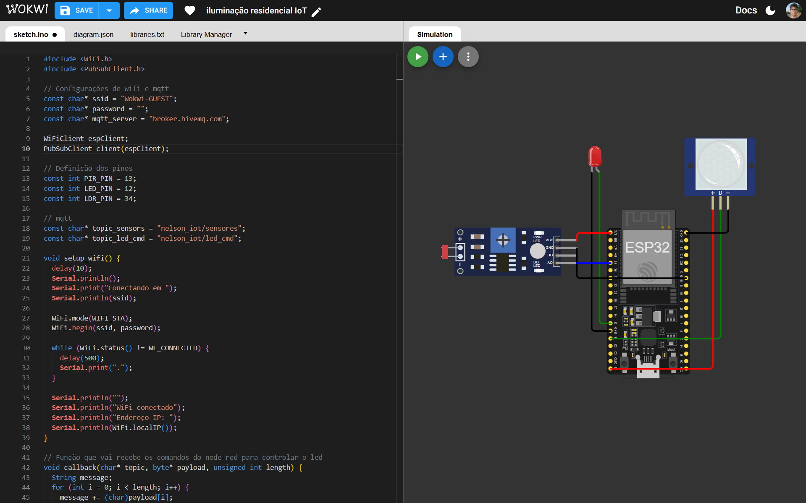
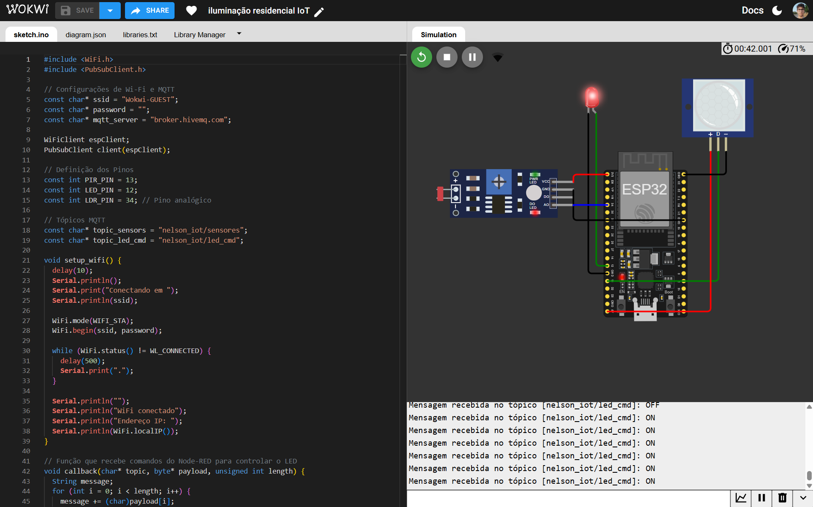
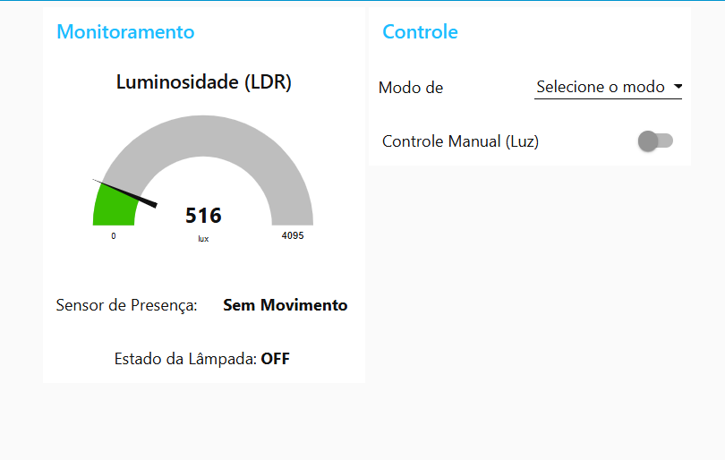
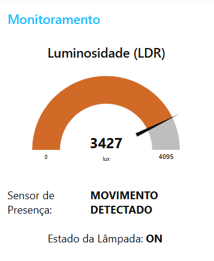
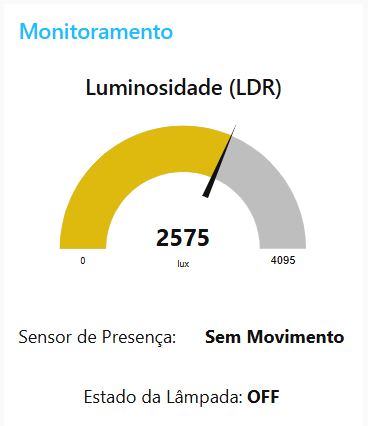
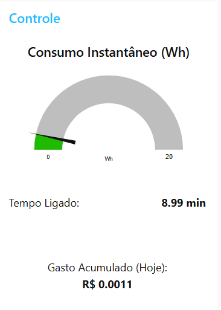
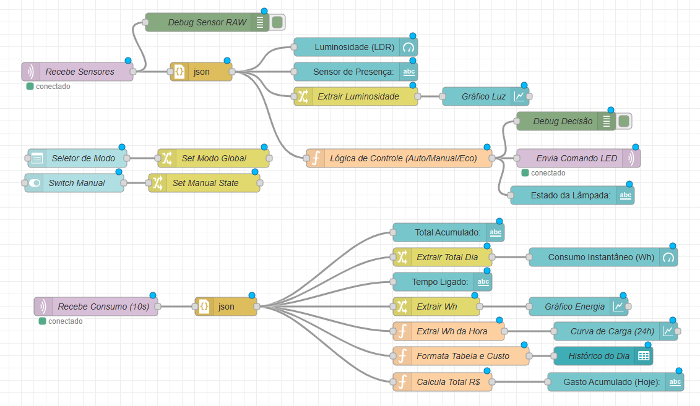

# Smart IoT Lighting System | ESP32 & Node-RED


This repository contains the complete firmware and architectural design for an **IoT Edge Node** developed in **C++**. The system monitors environmental conditions (motion and light) using an **ESP32** and provides a real-time control interface via **Node-RED** and the **MQTT** protocol.

> **Key Feature:** The system runs on a **Time Compression Algorithm** (1:60 scale), where a full 24-hour circadian cycle is simulated in just 24 minutes, allowing for rapid validation of energy consumption profiles.

---

## Project Overview

The system is designed to simulate a smart residential lighting solution with energy efficiency analytics. It collects telemetry data from a **PIR** sensor (motion) and an **LDR** (luminosity), publishing this information as **JSON** payloads.

**Main Features:**
* **Stochastic Environment Simulation:** Random generation of day/night cycles and human presence probability based on peak hours.
* **Energy Analytics:** Real-time calculation of Watt-hours (Wh), accumulated kWh, and financial cost (R$).
* **Dual Control:** Automatic mode (Sensor-based) and Manual override via Dashboard.
* **Robust Connectivity:** Reconnection algorithms for unstable network environments.

---

## System Architecture & Wiring

The hardware simulation was designed in **Wokwi**.

| Passive State (Idle) | Active State (Motion + Night) |
| :---: | :---: |
|  |  |
| *Standard wiring setup (LED OFF).* | *System detecting motion at night (LED ON).* |

---

## Real-Time Monitoring Dashboard

The user interface is built on **Node-RED Dashboard**, offering a clean layout for monitoring sensors, controlling the actuator, and analyzing energy costs.

### 1. Main Dashboard View
Full overview of the system operation, including real-time gauges and historical charts.

<div align="center">
  
</div>

### 2. Environmental Response
The system intelligently reacts to light levels based on sensor input.

| Low Light (Night) | High Light (Day) |
| :---: | :---: |
|  |  |
| *LDR < Setpoint + Motion = **ON*** | *LDR > Setpoint = **OFF** (Energy Saving)* |

### 3. Energy Consumption Analytics
A dedicated section tracks the financial impact and energy usage throughout the simulated cycle.

<div align="center">
  
  <p><i>Real-time accumulation of Wh and projected Cost (R$).</i></p>
</div>

---

## Backend Logic (Node-RED)

The logic layer manages the data flow, handles the JSON parsing, calculates costs, and applies conditional rules (Auto/Manual/Eco modes).

<div align="center">
  
</div>

---

## API & Data Structure

The system communicates via MQTT using JSON formatted payloads.

### Telemetry (ESP32 -> Broker)
**Topic:** `nelson_iot/consumo`
```json
{
  "consumo_kwh": 0.00145,
  "consumo_wh": 0.142,
  "media_dia_wh": 0.056,
  "total_dia_wh": 1.348,
  "tempo_ligado_min": 9.65,
  "led_estado": "ON"
}
